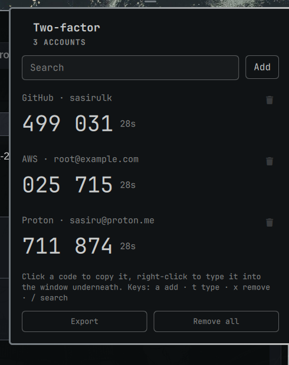

# 2FA

Two-factor codes in the Omarchy bar. Click one to copy it, or right-click to
type it straight into the window underneath.



Your shared secrets live in the login keyring, not in a file. Codes are
generated locally, in the shell process, from an implementation of RFC 6238
that is checked against the standard's own test vectors. The plugin makes no
network connections at all.

## Install

```
omarchy plugin add https://github.com/sasiruLK/omarchy-totp.git --enable
```

That places the icon in the right-hand section of the bar. To put it somewhere
else:

```
omarchy bar move io.github.sasirulk.totp --section center
```

## Adding an account

Click the bar icon, then **Add**:

- **Scan a QR code on screen** — leave the site's two-factor setup page open
  and pick this. It photographs your screen, not a camera, so it works on any
  machine, laptops included. Usually there is nothing to do: it reads the whole
  screen, finds the code and adds the account. Only if that turns up nothing —
  several QR codes on screen at once, or one too small to resolve — does it ask
  you to drag a box around the right one.
- **Paste an otpauth:// link** — for sites that offer the link instead of, or
  as well as, a QR code.
- **Enter a secret by hand** — for the "can't scan it?" fallback key. Defaults
  to 6 digits, 30 seconds and SHA-1, which is what almost every site uses.
- **Restore from an encrypted export** — see below.

Whatever the route, the secret is decoded and used to generate a code before
it is saved. A key with a typo in it is rejected at that point rather than on
the day you need to sign in.

## Using it

| | |
|---|---|
| Click a code | Copy it to the clipboard |
| Right-click a code | Type it into the window underneath |
| `a` | Add an account |
| `t` | Type the selected code |
| `x` | Remove the selected account (press twice) |
| `/` | Search |
| `↑` `↓` / `j` `k` | Move between accounts |
| `Enter` | Copy the selected code |
| `Esc` | Back, then close |

The countdown next to each code turns red for the last five seconds, so you
don't start typing a code that is about to roll over.

You can also bind a key to open it, in `~/.config/hypr/bindings.conf`:

```
bindd = SUPER, semicolon, 2FA codes, exec, omarchy-shell shell toggle io.github.sasirulk.totp
```

## Export and restore

**Export accounts to an encrypted file**, at the bottom of the list, writes
every account as a standard `otpauth://` link, encrypted with GnuPG using a
passphrase you choose. The file is created readable only by you.

Encryption is not optional here. An export contains every shared secret in
full; one sitting unencrypted in your home directory would undo the point of
keeping them in the keyring.

Because the file holds ordinary `otpauth://` links, it is a migration path to
any other authenticator, not a private snapshot. To read it anywhere:

```
gpg --decrypt 2fa-export-2026-08-19.asc
```

Restoring is under **Add → Restore from an encrypted export**. It adds the
accounts it finds and keeps the ones you already have. Anything already stored
is skipped, so restoring the same file twice is harmless.

Keep the file somewhere safe and remember the passphrase. Without it nobody can
open the file — including you.

## What it needs

Everything is already part of a standard Omarchy install; there is nothing to
add and no sudo or pkexec is required.

| | |
|---|---|
| `gnome-keyring` | Stores the shared secrets |
| `libsecret` | `secret-tool`, which talks to the keyring |
| `grim`, `slurp`, `zbar` | Screen-region QR scanning |
| `wl-clipboard` | Copying codes |
| `wtype` | Typing codes into the focused window (optional) |
| `gnupg` | Encrypting and reading exports |

The keyring has to be unlocked, which it normally is from the moment you log
in. If it is not, the panel says so instead of showing an empty list.

## Where things are kept

| | |
|---|---|
| Shared secrets | The login keyring, one entry per account, under the `omarchy-totp` service |
| Account names, digits, period, algorithm | `~/.local/share/omarchy-totp/accounts.json`, mode `0600` |

The two are deliberately separate. The file on disk names your accounts but
contains no secret, so a copy of it cannot generate a single code.

## Uninstall

`omarchy plugin remove` disables the plugin and deletes its directory. It does
not run any code from the plugin, so it cannot clean up the keyring entries or
the account list on its own — those two commands do:

```
omarchy plugin remove io.github.sasirulk.totp
secret-tool clear service omarchy-totp
rm -rf ~/.local/share/omarchy-totp
```

The bar layout entry is left behind too; remove it with:

```
omarchy bar move io.github.sasirulk.totp --section right
omarchy plugin disable io.github.sasirulk.totp
```

If you would rather do it before uninstalling, **Remove all accounts and data**
at the bottom of the list clears the keyring entries and the account file in
one step.

**Export first if you still need these accounts.** Removing the keyring entries
is not reversible, and a second factor you cannot generate is a locked door.

## Security

Community plugins run unsandboxed, inside the long-running `omarchy-shell`
process, with your user's permissions. That is worth knowing for any plugin and
worth reading the source for in one that holds your second factors. It is about
900 lines.

What this plugin does about it:

- **Secrets never appear on a command line.** They are written to
  `secret-tool` over stdin, and codes reach `wl-copy` and `wtype` the same way.
  `/proc/<pid>/cmdline` is readable by every process running as you.
- **Secrets are only in memory while the panel is open**, and dropped when it
  closes.
- **Account names are rendered as plain text, never as rich text.** A name
  comes from a QR code someone else generated. Qt will happily treat
  `` in a label as markup and fetch the URL; every label in
  this plugin is drawn with `Text.PlainText` so that cannot happen.
- **No network access of any kind.** TOTP is entirely offline. There is no HTTP
  client, no remote image, and no telemetry in the source.
- **The account file is created with owner-only permissions**, not created and
  then corrected, so there is no window where another local user could read it.
- **Every value from a QR code or a pasted link is validated** before it is
  stored, and control characters are stripped from names.

## Testing

```
test/run.sh
```

Covers the RFC 6238 test vectors for all three hash algorithms, the
`otpauth://` parser, the export round trip, and how the store handles corrupt
input. `TOTP_HARNESS=1 test/run.sh` additionally runs a Quickshell harness
against the real keyring — it exports, purges, restores, and checks everything
came back. That one destroys the accounts on the machine it runs on.

## License

MIT — see [LICENSE](LICENSE).
